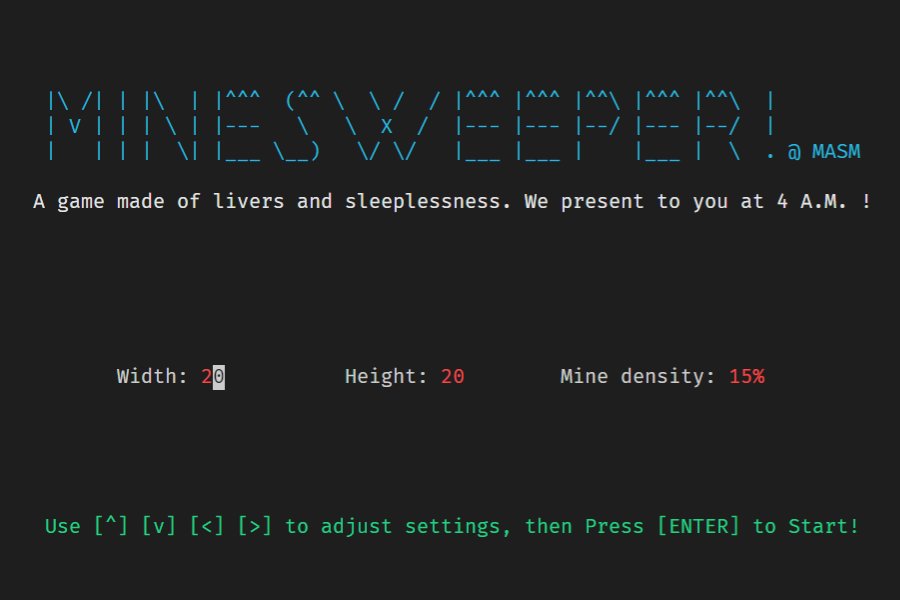
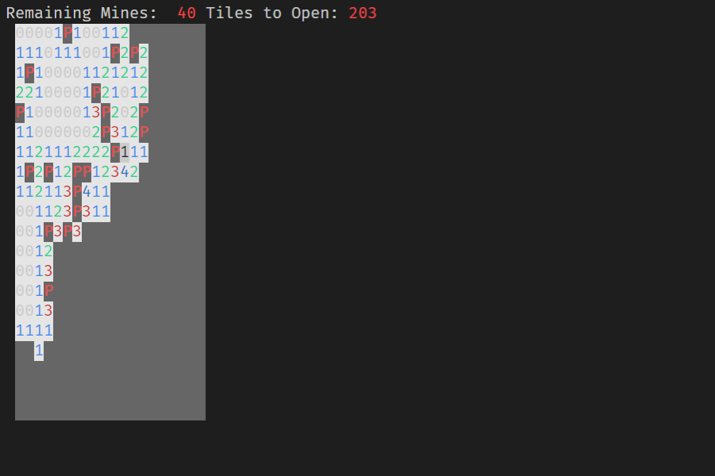
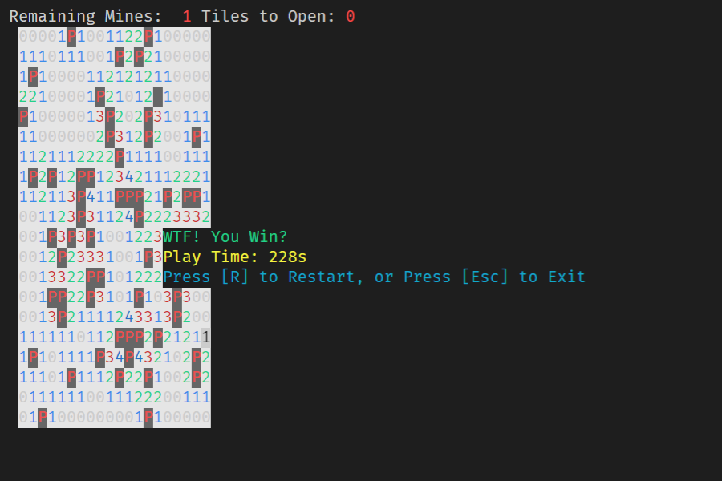

Minesweeper w/ MASM
===================

A game made of livers and sleeplessness. We present to you at 4 A.M. !

Introduction
------------

This is our final project of Assembly Language course when I was in college in 2014.

I like Minesweeper a lot. Hope you like it too! :)

Prerequisites
-------------

* MASM32 SDK - https://www.masm32.com/

* Irvine library - http://asmirvine.com/gettingStartedVS2019/index.htm

* GNU make (for Windows) - http://www.mingw.org/

Building
--------

Read the `Makefile` and set up the dependencies described above, then run `make` to build.

Game Controls
-------------

* Press `Z` - do a left click
  * open a tile

* Press `X` - do a right click
  * toggle a flag (on an unopened tile)
  * auto-open tiles (on an opened tile).

Screenshots
-----------

License
-------

Copyright © 2014 Raku Zeta. Licensed under the MIT license.
